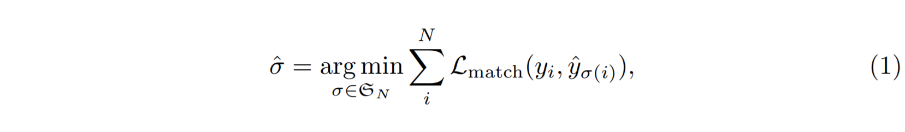
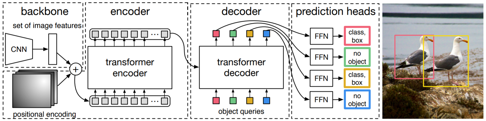

# End-to-End Object Detection with Transformers
## Nicolas Carion, Francisco Massa, Gabriel Synnaeve, Nicolas Usunier, Alexander Kirillov, and Sergey Zagoruyko
## Facebook AI Research (FAIR)
## Arxiv 2020

[[arxiv]](https://arxiv.org/abs/2005.12872) [[official code (pytorch)]](https://github.com/facebookresearch/detr) [[unofficial code (tensorflow)]](https://github.com/Leonardo-Blanger/detr_tensorflow)  
[The DETR model](#The-DETR-model)

# The DETR model
- A set prediction loss that forces unique matching between predicted and ground truth boxes
- An architecture that predicts (in a single pass) a set of objects and models their relation
## Object detection set prediction loss
- A fixed-size set of  predictions
    -  : larget than the typical number of objectes in an image
### Matching loss
- An optimal bipartite matching between predicted and ground truth objects
- Object-specific (bounding box) losses
    -  : the ground truth set of objects
    -  : the set of N predictions
    

    -  : a pair-wise *matching cost* between ground truth  and a prediction with index 
    - Hungarian algorithm [[arxiv]](https://arxiv.org/abs/1506.04878)
    - 
- *Hungarian loss*
    

    -  : the optimal assignment computed in the first step (eq.1)
### Bounding box loss
- A linear combination of the  loss
- The generalized IoU loss
- 

## DETR architecture

### Backbone
-  : the initial image
-  : a lower-resolution activation map
    -  and 

### Transformer encoder
- A 1x1 convolution reduces the channel dimension of the high-level activation map  from  to a smaller dimension  creating a new feature map .
- The spatial dimensions of  is collapsed into one dimension, resulting in a  feature map.
- Each encoder layer has a standard architecture and consists of a multi-head self-attention module and a feed forward network (FFN).
- Each encoder layer is supplemented with fixed positional encodings that are added to the input of each attention layer.

### Transformer decoder
- Decoder decodes the  objects in parallel at each decoder layer.
- The  input embeddings are learnt positional encodings that are refered as *object queries*.
- Object queries are added to the input of each attention layer.
- Output embeddings are *independently* decoded into box coordinated and class labels b y a feed forward network, resulting  final predictions.

### Prediction feed-forward networks (FFNs)
- A 3-layer perceptron with ReLU activation function and hidden dimension , and a linear projection layer
- Because of a fixed size set of  bounding boxes, an additional special class label  is used to represent that no object is detected within a slot. This class plays a similar role to the "background" class in the standard object detection approaches.

### Auxiliary decoding losses
- To help the model output the correct number of objects of each class
