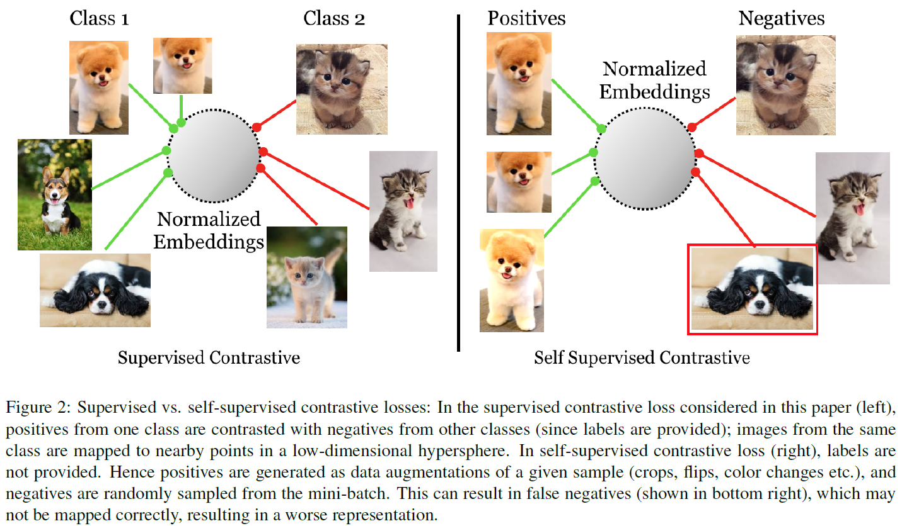
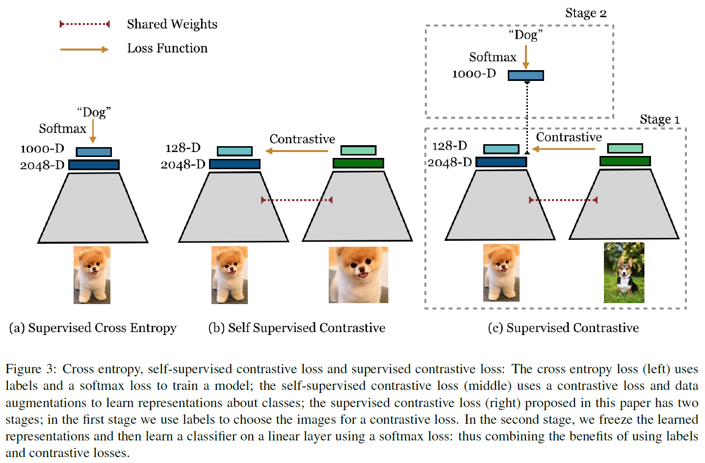
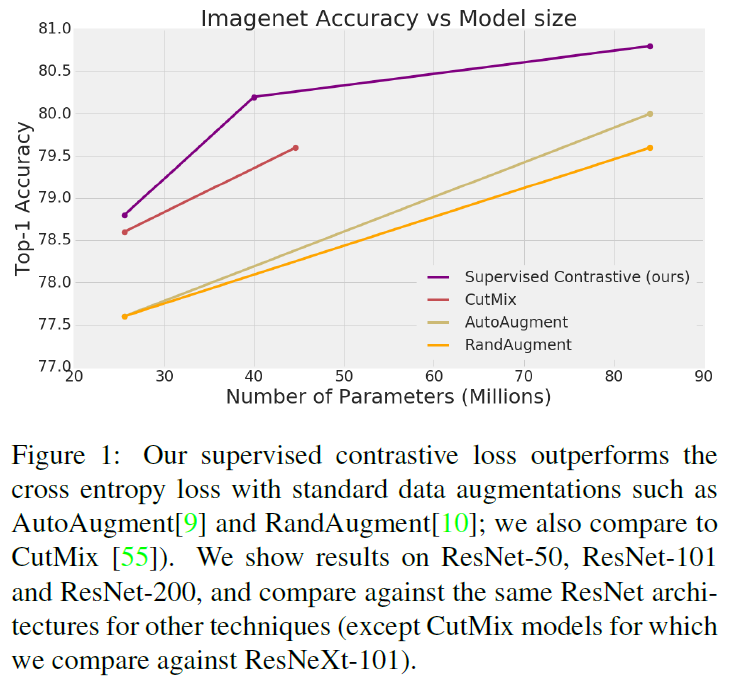
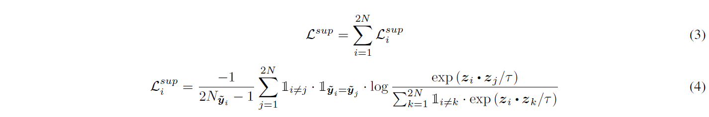
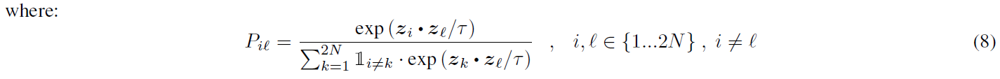
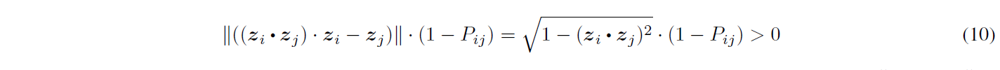
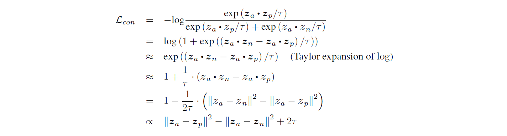
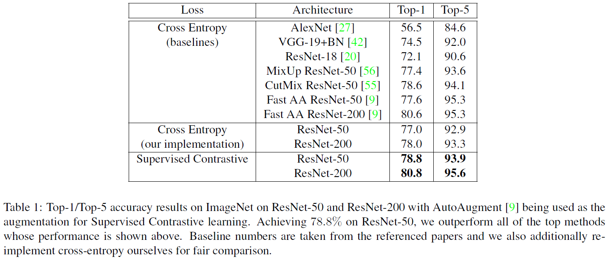
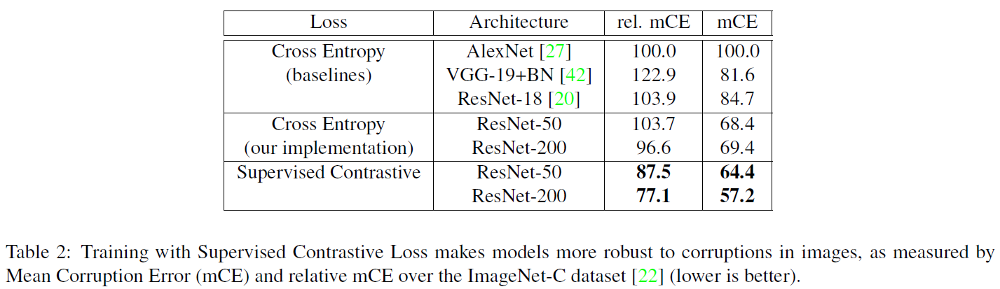
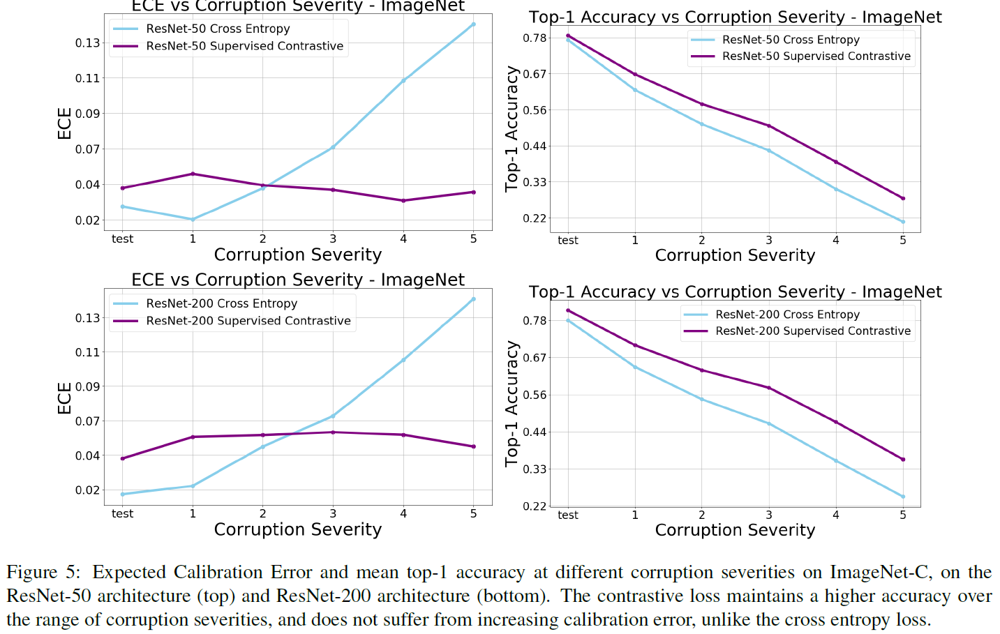

# Prannay Khosla, Piotr Teterwak, Chen Wang, Aaron Sarna, Yonglong Tian, Phillip Isola, Aaron Maschinot, Ce Liu, and Dilip Krishnan, *"Supervised Contrastive Learning"*, in Arxiv 2020. [[arxiv]](https://arxiv.org/abs/2004.11362)

[1. Introduction](#1.-introduction)  
[2. Related Work](#2.-related-work)  
[3. Method](#3.-method)  
[4. Experiments](#4.-experiments)  
[5. Discussion](#5.-discussion)  

# 1. Introduction
- cross-entropy loss는 supervised learning에서 많이 사용됨  
    - 이는 label distribution과 empirical distribution의 KL-divergence로 정의
- cross-entropy를 개선하기 위한 방법으로 loss의 정의를 완화
    - e.g. reference distribution은 axis-aligned
    - Label smoothing (C. Szegedy et al., 2016.) : fuzzy distinction between correct and incorrect labels by moving off-axis
    - Self-distillation (G. Hinton et al., 2015.) : multiple rounds of cross-entropy training
    - Mixup (H. Zhang et al., 2017.) : create explicit new training examples and apply the same linear interpolation to the target distribution
- 같은 클래스는 가깝게하고 다른 클래스는 멀리하는 새로운 supervised training loss 제안
    - self-supervised learning에서 좋은 성능을 보이고 metric learning과 많은 연관이 있는 *contrastive* objective functions
    - contrastive loss는 두 개의 "opposing force"로 구성
        - *anchor* point가 주어짐
        - 첫 번째 force는 anchor를 다른 point들과 가깝게 당김 : positives
        - 두 번째 force는 ahcnor를 다른 point들과 멀게 밀어냄 : negatives
    - self-supervised contrastive learning에서 single positive를 사용한 것과 달리, 이 논문에서는 many positive들을 고려함
    

    

    - Auto-Augment를 사용한 ResNet-50의 결과, cross-entropy loss를 사용한 것보다 supervised contrastive loss를 사용한 경우가 1.6% 높았음
    

- Main contributions
    1. anchor당 multiple positives를 적용한 contrastive loss를 사용하여 full supervised setting에서 contrastive learning을 진행
    2. cross-entropy와 비교했을 때 top-1 accuracy와 robustness에서 state of the art 기록
    3. cross-entropy보다 hyperparameter 범위에 덜 민감
    4. hard positive와 hard negative의 학습을 촉진하는 gradient + single positive와 negative가 사용되었을 때 triplet loss와 연관성
# 2. Related Work
- self-supervised representation learning + metric learning + supervised learning
- cross-entropy loss는 deep networks를 학습하기 위한 powerful한 loss function
    - 왜 target label이 optimal이어야 하는지 명확하지 않음
    - 더 좋은 target label vector가 존재함이 증명됨 (S. Yang et al., 2015.)
- cross-entropy loss 다른 단점들을 연구
    - sensitivity to noisy labels (Z. Zhang et al., 2018., S. Sukhbaatar et al., 2014.)
    - adversarial examples (G Elsayed et al., 2018., K. Nar et al., 2019.)
    - poor margins (K. Cao et al., 2019.)
- 다른 loss들이 제안되었지만, reference label distribution을 바꾸는 것이 현실에서 더 유명하고 효율적인 방법
    - Label Smoothing (C. Szegedy et al., 2016., R. Muller et al., 2019.)
    - Mixup (H. Zhang et al., 2017.)
    - CutMix (S. Yun et al., 2019.)
    - Knowledge Distillation (G. Hinton et al., 2015.)
- 최근에 self-supervised representation learning이 각광받는 중
    - language domain
        - pre-trained embedding (J. Devlin et al., 2018., Z. Yang et al., 2019., An Mnih et al., 2013.)
        - Downstream fine-tuning이 sentiment classification과 question answering에서 좋은 성능을 보임
        - 많은 양의 unlabeled data를 아주 큰 architecture와 함께 사용할 수 있게 됨
    - image domain
        - embedding을 배우기 위해 사용 (C. Doersch et al., 2015., R. Zhang et al., 2016., R. Zhang et al., 2017., M. Noroozi et al., 2016.)
            - 가려진 signal 부분을 가려지지 않은 부분으로 예측
            - network가 semantic information을 학습하는 것이 매우 중요
            - 이미지처럼 high dimensional signal에서는 매우 어려움
            - input space의 dense per-pixel predictive loss를 lower-dimensional representation space의 loss로 바꾸는 것도 방법
        - self-supervised representation learning은 contrastive learning으로 바뀜
            - noise contrastive estimation (M. Gutmann et al., 2010., A. Mnih et al., 2013.)
            - N-pair loss (K. Sohn et al., 2016.)
            - 학습할 때 deep network의 마지막 레이어에 loss를 적용하고, 테스트 시 downstream transfer task, fine tuning, direct retrieval task를 위해 이전 레이어를 활용
- contrastive learning은 metric learning과 triplet loss와 연관있음
    - 공통점은 powerful representation을 학습한다는 것
    - triplet loss와 contrastive loss의 차이점은 data point당 positive, negative pair의 수
        - triplet loss
            - one positive and one negative pair
        - supervised metric learning
            - positive는 같은 클래스에서, negative는 다른 클래스에서 (hard negative mining, F. Schroff et al., 2015)
        - self-supervised contrastive loss
            - one positive pair selected using either co-occurence or using data augmentation
            - 가장 다른 점은 많은 negative pair들이 각 data point에서 사용된다는 점
- supervised contrastive와 가장 유사한 것은 soft-nearest neighbor loss
    - 공통점 : embedding을 normalize, euclidean distance를 inner product로 교체
    - 개선 : data augmentation, disposable contrastive head, two-stage training
    - mini batch 내에서 contrasting하여 Z. Wu et al.에서 나온 approximation(loss의 일부분을 backpropagation, memory bank형태의 stale representation)들을 해소
    - N. Frosst et al.에서 중간 레이어들을 maximizing하여 클래스들을 entangle한 것과 반대로, 마지막 레이어에서 클래스들을 disentangle
# 3. Method
- 최근 self-supervised representation learning에 사용된 contrastive learning loss 점검 (36, 21, 46, 6)
    - self-supervised approach를 보존하는 동시에, fully supervised learning에 적합한 방향으로 어떻게 수정했는지 설명
    - 사실 self-supervision과 full supervision의 중간은 semi-supervision이지만, 여기서는 다루지 않을 예정
## 3.1. Representation Learning Framework
- self-supervised contrastive learning을 사용한 Y. Tian et al., 2019.와 T. Chen et al., 2020.과 구조적으로 유사함
    - A *data augmentation* module () : input image 를 randomly augmented image 로 변경
    - 각 input image에 대해 다른 *view*를 나타내고 원본 이미지의 정보를 일부 포함하는 두 개의 randomly augmented image를 생성
        - first stage of augmentation : random crop + resize to the image's native resolution
        - second stage
            - self-supervised contrastive loss는 cross-entropy loss와 다른 data augmentation이 요구됨
            - AutoAugment (E. E. Cubuk et al., 2019.)
            - RandAugment (E. D. CUbuk et al., 2019.)
            - SimAugment (T. Chen et al., 2020.)
    - An *encoder network* () : augmented image 를 representation vector 에 나타냄
        - 두 augmented image는 같은 encoder에 각각 representation vector의 pair로 들어감
            - ResNet50과 ResNet200의 마지막 pooling layer(=2048)를 representation vector로 사용
            - 이 representation layer는 의 unit hypersphere에서 항상 normalize
            - 실험을 통해 이 normalization이 다른 논문들과 일관되게 항상 성능을 향상시킴을 보임
            - 특별한 hyperparameter tuning(e.g. optimizer, data augmentation, ...)없이 이러한 architecture들을 높은 성능으로 학습할 수 있었음
    - A *projection network* () : normalized representation vector 을 contrastive loss 계산에 적합한 vector 로 나타냄
        - projection network로 2048 single hidden layer 의 output vector size를 가진 multi-layer perceptron 사용
        - vector를 unit hypersphere에 놓기 위해 normalize : inner product가 projection space 내 거리를 측정
        - 이 projection network는 supervised contrastive loss에서만 사용됨
        - 학습이 완료되면, projection network를 없애고 single linear layer로 교체함
        - self-supervised contrastive learning과 유사하게 projection network의 representation보다 downstream task에서 좋은 성능을 보이는 encoder의 representation을 찾음
        - inference 시 모델의 parameter는 cross-entropy인 경우와 같음
## 3.2. Contrastive Losses: Self-Supervised and Supervised
- contrastive loss의 이점은 유지한 채 labeled data를 효과적으로 사용하는 contrastive loss를 발견
    - randomly sampling으로 N 개의 image/label pairs 생성 ()
    - 실질적으로 학습에 사용되는 minibatch는 2N pairs ()
        - 와 은 의 two random augmentations
        - 
### 3.2.1 Self-Supervised Contrastive Loss
-  : the index of an arbitrary augmented image
-  : the index of the other augmented image originating from the same source image
    

    - 

        -  : projection network
        -  : encoder network
    -  : an indicator function that returns 1 iff B evaluates as true
    -  0" title="\tau > 0" /> : a scalar temperature parameter
    -  : *anchor*
    -  : *positive*
    - other  indices  : *negatives*
    -  : an inner (dot) product between the normalized vectors  and  in 128-dimensional space
    - anchor 당 1 positive pair + 2N-2 negative pairs
    - 분모에는 2N-1 (positive와 negatives)
    - Eq 1.를 최소화하기 위해 Eq 2.의 분자를 최대화, 분모를 최소화
    - 분자와 분모 모두 있는 는 log argument가 1보다 작도록 함
    - encoder는 similar view는 neighboring representation, dissimilar view는 non-neighboring representation으로 학습
### 3.2.2 Supervised Contrastive Loss
- supervised learning에서는 같은 클래스에 속해있는 샘플이 하나보다 많기 때문에 Eq 2.의 contrastive loss를 사용할 수 없음
- 임의의 개수의 positive를 loss에서 사용하기위해 아래의 loss 제안
    

    -  : the total number of images in the minibatch that have the same label, , as the anchor, 
- **Generalization to an arbitrary number of positives**
    - Eq 4.와 Eq 2.의 구조적 차이는 minibatch 내 모든 positive들이 분자에 영향을 끼친다는 것
    - 클래스의 수와 관련된 큰 minibatch 사이즈로 추가적인 term이 필요 ()
    - loss는 encoder가 같은 클래스 내 모든 데이터를 Eq.2 보다 더 robust clustering으로 가깝게 표현하도록 함
- **Contrastive power increases with more negatives**
    - self-supervised contrastive loss는 signal과 noise(negative)를 negative sample을 더 추가함으로써 잘 구분해내는 noise contrastive estimation과 N-pair loss의 영향을 받음
    - supervised contrastive loss 역시 분모에 negative를 많이 추가하여 positive와 멀리 떨어지도록 함
- positive와 negative를 많이 사용하여 *intra-classs*와 *inter-class*에서 좋은 성능을 보이도록 함
### 3.2.3 Supervised Contrastive Loss Gradient Properties
- gradient를 통해 supervised contrastive loss가 *weak* positive와 negative보다 *hard* positive와 negative에 초점을 둔 학습방법임을 증명
- triplet loss같은 다른 contrastive loss들은 hard negative mining에 computationally expensive technique
- projection network의 마지막에 normalization layer 추가하여 gradient가 inner product할 때 의미를 갖게 함
-  : the projection network output immediately *prior* to normalization (i.e., )

- the 'th component of the temperature-scaled sofrmax distribution of inner products of representations with respect to anchor 
    - 확률로 표현 가능!
- Eq.6 : positives / Eq.7 : negatives
- easy positive와 negative는 small gradient를 갖고, hard positive와 negative는 large gradient를 가짐
    - easy positive : ,  is large.
    

    - hard positive : ,  is moderate.
    

    - weak positive는  이 작고, hard positive는 큼
    - 마찬가지로 weak negative는 , hard negative는  이므로  에 각각 영향을 미침
    -  는 normalization layer가 projection network 마지막에 붙어있을 때만 그 역할을 할 수 있으므로 network에 normalization을 무조건 사용해야함!
## 3.3. Connections to Triplet Loss
- contrastive learning은 triplet loss와 밀접한 연관이 있음
    - triplet loss는 positive와 negative를 각각 하나씩 연산
    - positive와 negative가 각각 하나씩인 contrastive loss로 생각할 수 있음
    - anchor, positive의 representation이 anchor, negative보다 더 잘 맞춰졌다고 가정 ()
    

    
    - margin 인 triplet loss와 동일한 형태
    - 실험 결과를 통해 contrastive loss가 triplet loss보다 representation task에서 더 좋은 결과를 보임
    - triplet loss는 hard negative mining에서 computationally expensive했지만, contrastive loss는 학습 중에 자연스럽게 hard negative reinforcement의 측정치를 적용
    - 물론 large batch size에서 cost가 많이 들어서 결국 같음^^
# 4. Experiments
- classification accuracy on ImageNet & robustness to common image corruptions
- 학습 후엔 projection head를 new randomly initialized linear fully connected layer로 교체
- embedding network의 parameter들은 모두 freeze하고 linear layer는 standard cross entropy로 학습
## 4.1. ImageNet Classification Accuracy
- supervised contrastive loss가 ImageNet에서 SOTA기록

## 4.2. Robustness to Image Corruptions and Calibration
- ImageNet-C를 이용한 robustness에서도 SOTA기록

## 4.3. Hyperparameter Stability
- hyperparameter의 변화에서도 안정된 성능 유지
    - different optimizer, data augmentation, learning rates
    - optimizer와 augmentation의 변화에서 작은 분산을 보임
        - hypersphere의 smoother geometry 덕분이라고 추측

## 4.4. Effect of Number of Positives
- positive의 수의 영향에 대해 ablation study
    - positive의 수를 늘리면 늘릴수록 성능이 좋아짐
    - positive의 수를 늘릴수록 computational cost가 높아지는 trade-off
    - positive에는 같은 데이터지만 다른 augmentation한 경우도 포함되고 나머지는 같은 클래스지만 다른 샘플
    - self-supervised learning은 1 positive

## 4.5. Training Details
- epochs : 700 (pretraining stage)
    - 절반 (350 epoch)만 학습하면 top-1 accuracy가 조금 떨어짐
    - 각 스텝마다 cross-entropy보다 50%정도 느렸는데, 이는 미니배치 내 모든 요소들과 cross-product를 계산해야했기 때문
    - transfer learning task 또는 retrieval 이외에는 final linear classifier에 대해 추가 학습이 필요
- batch size : ~ 8192 (2048정도면 충분할 듯)
    - ResNet-50은 8192, ResNet-200은 2048 (큰 네트워크일수록 작은 batch size가 필요)
    - 고정된 batch size에서 cross-entropy와 비슷한 성능을 갖는데 larger learning rate와 적은 epoch으로 가능
    - embedding network를 freeze하고 dense layer를 학습할 때는 적은 step (e.g. 10 epoch)도 충분함
- temperature : 
    - temperature는 작을수록 좋은 성능을 보임
    - 하지만 낮은 temperature는 numerical stability 문제로 학습이 어려울 수 있음
- AutoAugment가 Supervised Contrastive와 Cross Entropy 모두에서 좋은 성능을 보임
- LARS, RMSProp, SGD with momentum을 different permutation으로 initial pre-training step과 dense layer 학습
    - ResNet을 cross entropy로 학습할 때 momentum optimizer가 좋은 성능을 보였지만, supervised contrastive loss를 사용했을 땐 pre-training에는 LARS, frozen network의 dense layer 학습에는 RMSProp이 좋은 성능을 보임
# 5. Discussion
- classification accuracy와 robustness benchmarks에서 cross entropy보다 좋은 성능을 보인 supervised contrastive loss 제안
- 실험으로 hyperparameter변화에 덜 민감한 사실을 밝혀냄
- loss function이 fully unsupervised training과 fully supervised training을 자연스럽게 연결
- semi-supervised learning로의 확장 가능성도 보임