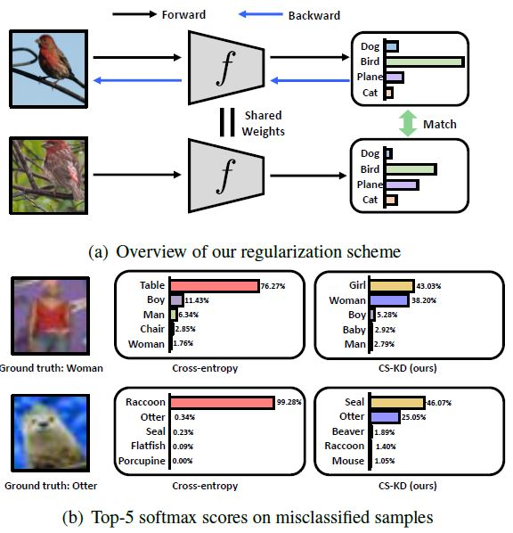
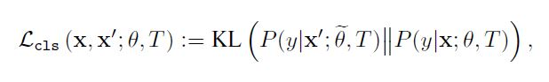
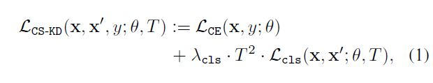
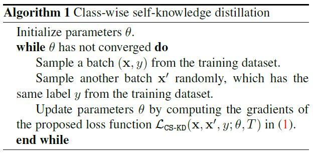
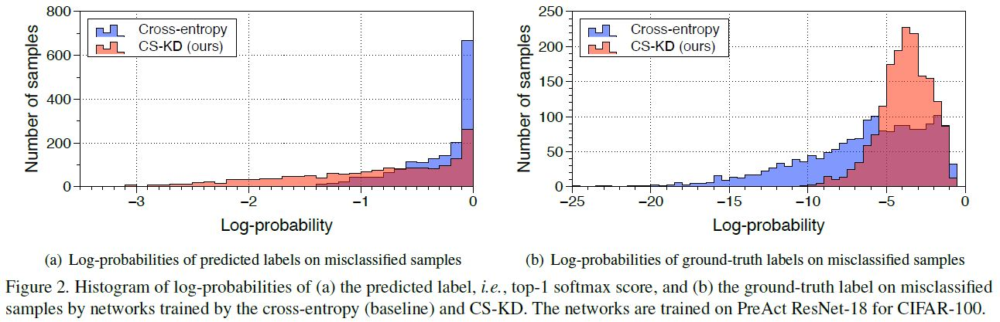

# Regularizing Class-wise Predictions via Self-knowledge Distillation
**Sukmin Yun, Jongjin Park, Kimin Lee, and Jinwoo Shin**  
**KAIST**  
**CVPR 2020**  
  
[[arxiv]](https://arxiv.org/abs/2003.13964) [[official code (pytorch)]](https://arxiv.org/pdf/2003.13964.pdf)  
  
## Contents
[Class-wise Self-Knowledge Distillation (CS-KD)](#Class-wise-Self-Knowledge-Distillation-(CS-KD))  
[Class-wise regularization](##Class-wise-regularization)  
[Effects of class-wise regularization](##Effects-of-class-wise-regularization)

# Class-wise Self-Knowledge Distillation (CS-KD)
## Class-wise regularization
- 같은 클래스에 속하면 틀렸을 경우의 분포(Dark knowledge)도 같아야 함
- Class-wise regularization loss
    - 같은 클래스에 속하는 데이터는 일정한 predictive distribution을 갖도록 유도
    

    

    -  : the standard cross-entropy loss
    -  0" title="\lambda_{\text{cls}} > 0" /> : a loss weight for the class-wise regularization
    

## Effects of class-wise regularization
- 두 가지 성과를 얻을 수 있는 가장 간단한 방법
    - overconfident prediction 방지
        - **모델이 생성한 soft-label**
            - 새로 만든 soft-label을 사용하는 label-smoothing보다 **현실적임**
    - intra-class variation 감소
        - 같은 클래스의 logit 사이 거리를 최소화
- 잘못 예측한 샘플에 대한 score를 감소시키고 ground truth에 대한 score를 증가시킴

